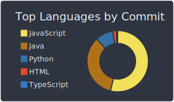
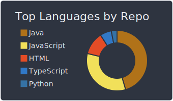
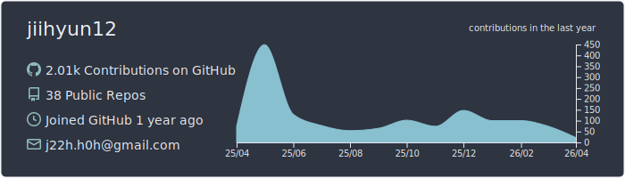

<h1 align="center">
  
</h1>

## Profile 

📞 **Email** | j22h.h0h@gmail.com  
✉ **Phone** | 010-8564-9679  

---
## 🚀 Skills

### 🖥 Backend Development

### 💾 Database

### ⚙ Industrial Automation / SCADA

### 🎨 Frontend

### 🛠 Tools & DevOps

### 🎬 Design & Creative

---

## 🎨 Most Used Languages

  
  

---

## 📈 Activity Details

  

---

## 📝 Study

### 🐣 BaekJoon

### 🧩 Programmers  
[Programmers](https://programmers.co.kr/users/challenge-activity)

<!-- ✏️ **BLOG** | https://blog.naver.com/dyun_d -- !>  

<!--
**jiihyun12/jiihyun12** is a ✨ _special_ ✨ repository because its `README.md` (this file) appears on your GitHub profile.
-->
