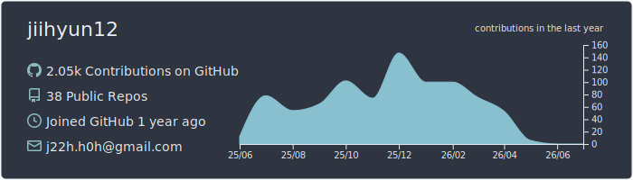

<h1 align="center">
  
</h1>

## 👤 Profile

  🏢 <b> <a href="http://www.snitc.co.kr" target="_blank">에스엔아이티씨(주)</a> Software Engineer </b> (2025. 06. ~ Present)  
  ✉ <a href="mailto:j22h.h0h@gmail.com">j22h.h0h@gmail.com</a>

---
## 🚀 Tech Stack & Learning
### ⚙ Industrial Automation / SCADA

### 🖥 Backend & Data (Learning & Exploring)

---

## 📈 Activity Details

  

